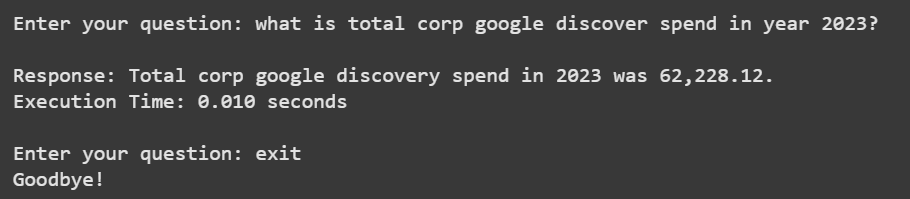
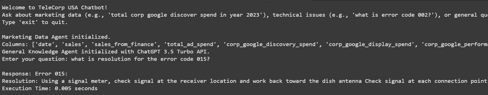
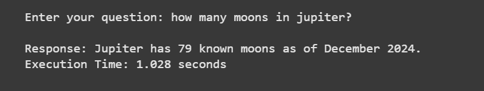

# TeleCorp USA Chatbot 🤖

Welcome to **TeleCorp USA Chatbot**, an intelligent Python-based assistant designed to tackle marketing analytics, technical support, and general inquiries with ease. Powered by cutting-edge NLP (Sentence Transformers), RAG (Retrieval-Augmented Generation), and OpenAI's GPT-3.5 Turbo, this project demonstrates modern AI workflows using LangGraph.

---

## ✨ Key Features
- **Marketing Insights**: Query telecom marketing data (e.g., "What’s the total Google Discover spend in 2023?").
- **Tech Support**: Fetch error code resolutions from PDFs (e.g., "How do I fix error 002?").
- **General Q&A**: Ask anything, from "What’s today’s date?" to broader questions via GPT-3.5.
- **Smart Search**: Combines exact matching with semantic search for precise and flexible responses.

## 🚀 Why This Project?
- **Real-World Use Case**: Simulates a customer support chatbot for a telecom company.
- **Tech Stack**: Showcases expertise in NLP, data processing, and AI integration.
- **Open Source**: Contributions welcome—help make it better!

---
## Screenshots
### Marketing Query


### Technical Support


### General Knowledge


## 🛠️ Getting Started

### Prerequisites
- Python 3.8+
- OpenAI API Key (sign up at [OpenAI](https://platform.openai.com/))
- Sample files: `telecom.csv`, `Error Codes.pdf`

### Installation
1. Clone the repo:
   ```bash
   git clone https://github.com/sudarsans2001/TeleCorp-USA-Chatbot.git
   cd telecorp-usa-chatbot